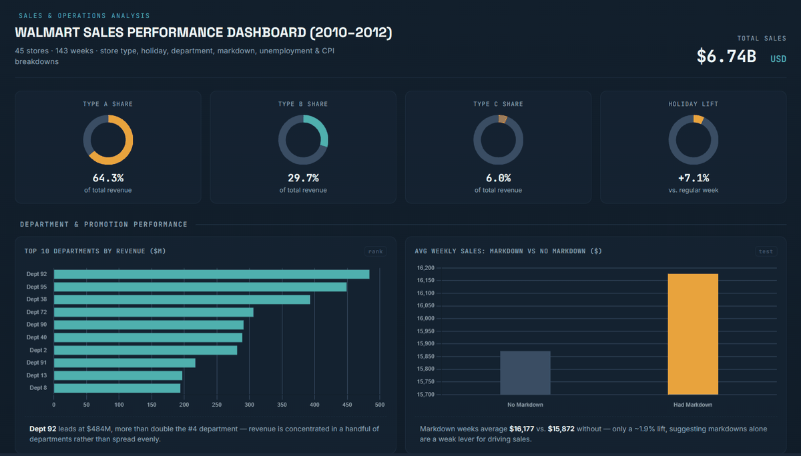
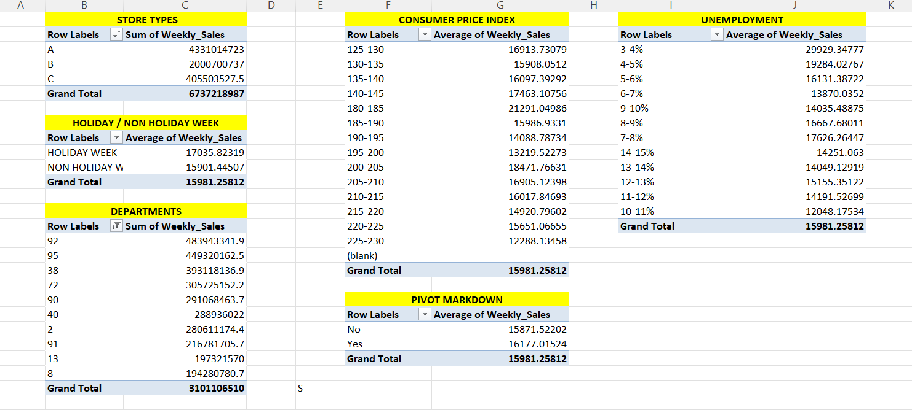

# 🛒 Walmart Sales Performance Analysis (2010–2012)

### 🎯 Brief Project Info :-

- I built a Walmart Sales Performance Analysis using Excel, combining pivot tables, VLOOKUP-based store classification, and formula-driven KPIs.
- The report highlights key patterns in sales by store type, holiday impact, department performance, markdown effectiveness, and economic sensitivity.
- The final dashboard offers a clear, data-driven view of what actually drives Walmart's weekly revenue.

---

## 📂 Dataset

- Source: [Walmart Recruiting - Store Sales Forecasting (Kaggle)](https://www.kaggle.com/c/walmart-recruiting-store-sales-forecasting)
- 421,570 weekly sales records across 45 stores, 143 weeks (2010–2012)

---

## 📍 Key KPI Highlights

| Metric | Value |
|---|---|
| **Total Sales Analyzed** | **$6.74B** |
| **Records Analyzed** | 421,570 weekly sales rows |
| **Stores Covered** | 45 (Types A, B, C) |
| **Time Period** | 2010–2012 |
| **Holiday Sales Lift** | **+7.1%** vs regular weeks |

**Key Insight:** Even though holiday weeks make up a small fraction of the calendar, they consistently outperform regular weeks — a **7.1% lift** ($17,036 vs $15,901 avg) worth planning inventory and staffing around.

---

## 🏬 By Store Type

| Store Type | Total Sales | % Share |
|---|---|---|
| **Type A** | **$4.33B** | **64.3%** |
| Type B | $2.00B | 29.7% |
| Type C | $0.41B | 6.0% |

**Key Insight:** Type A (large-format) stores generate almost **two-thirds of all revenue**, despite being only one of three store formats — a strong signal for where expansion investment pays off most.

---

## 🏆 Top 5 Departments by Revenue

| Department | Total Sales |
|---|---|
| **Dept 92** | **$484M** |
| Dept 95 | $449M |
| Dept 38 | $393M |
| Dept 72 | $306M |
| Dept 90 | $291M |

**Key Insight:** Dept 92 alone brings in more than double the #4 department — revenue is concentrated in a handful of departments rather than spread evenly.

---

## 🏷 Markdown Campaign Effectiveness

| Markdown Status | Avg Weekly Sales |
|---|---|
| **Had Markdown** | **$16,177** |
| No Markdown | $15,872 |

**Insight:** Markdown weeks average only ~1.9% higher sales than non-markdown weeks — suggesting markdowns alone are a relatively weak lever for driving revenue.

---

## 📊 Economic Sensitivity (CPI & Unemployment)

- Sales peak in the **180–185 CPI band** ($21,291) then trend down at higher CPI — a non-linear relationship, not a straight-line correlation.
- Sales are highest in the rare **3–4% unemployment** band, then flatten around $14K–$17K across the rest of the range — unemployment alone doesn't cleanly predict sales.
- **Insight:** Consistent with Walmart's position as a value-oriented retailer — sales don't collapse under inflation or unemployment pressure the way they might for premium retailers.

---

## ⚠️ Store Sales Volatility

- Measured **Coefficient of Variation (CV)** per store to flag which locations have the most unpredictable week-to-week sales.
- **Store 43** is the least predictable (CV 0.327) — more than double Store 44's 0.151 — flagging where forecasting and staffing need extra buffer.

---

## High-Level Insights Summary

🔥 **Top Revenue Drivers**
1. **Type A (large-format) stores** — 64.3% of total revenue
2. **Holiday weeks** — consistent +7.1% sales lift
3. **Dept 92** — single largest department, 2x the #4 department

📉 **Economic Resilience**
- Sales show a non-linear, resilient relationship with both CPI and unemployment — no simple "inflation hurts sales" pattern.

⚠️ **Forecasting Risk**
- A handful of stores (led by Store 43) show significantly higher sales volatility — these need larger safety buffers in demand planning.

---

## 💡 Recommendations

1. **📦 Prioritize Inventory for Holiday Weeks:** Increase stock and staffing ahead of major holidays given the consistent ~7% sales lift.
2. **🏬 Focus Expansion on Large-Format (Type A) Stores:** These deliver the highest revenue share and warrant continued investment.
3. **🏷 Re-evaluate Markdown ROI:** With only a ~1.9% sales lift, markdown campaigns should be tested against their actual cost before scaling further.
4. **📊 Add Volatility Buffers for High-Risk Stores:** Stores like #43 and #42 need wider forecasting margins due to unpredictable demand.
5. **🌎 Don't Over-React to Economic Indicators:** Sales resilience across CPI/unemployment ranges means forecasting models shouldn't over-weight macroeconomic swings.

---

## 📊 Dashboard

## 📋 Pivot Tables

---

## Tools & Techniques Used

`Excel` `Pivot Tables` `VLOOKUP` `Data Cleaning` `Chart Visualization`

- Cleaned and merged 3 source files (sales, store attributes, economic/promo data) into one 421,570-row dataset
- Handled missing values (markdown blanks filled with 0), flagged negative sales as returns, added derived time columns
- Built pivot tables answering distinct business questions: store type, holiday impact, departments, markdown effectiveness, CPI, unemployment
- Used VLOOKUP to classify stores into performance tiers based on efficiency ranking

## About

Excel-based sales performance analysis using real, publicly available Walmart transactional data (2010–2012).

